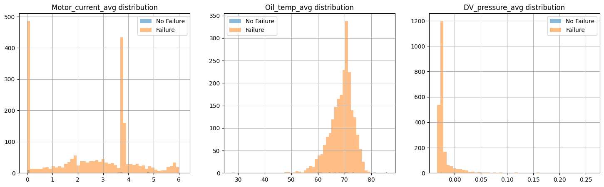

# Metro Rail Predictive Maintenance
**Forecasting Remaining Useful Life (RUL) of train compressor/hydraulic systems**

loom breakdown: https://www.loom.com/share/c2839839930f46f69e5d78a72f81a77a

---

## 0. Executive Summary (Business Problem)
Unplanned compressor/hydraulic failures cause service delays, car set-outs, and secondary damage.  
Goal: predict **RUL in minutes** for each unit to enable planned maintenance before failure.

**Primary KPIs**
- Failures avoided / 1,000 operating hours
- Mean Time Between Failures (MTBF)
- Delay minutes avoided
- Maintenance cost delta vs. corrective maintenance
- On-time performance impact

**Actionable output**
- `rul_minutes` + risk band (Critical/High/Medium/Low)
- Recommended action and lead time (e.g., “swap unit within 90 minutes”)
  

### Business flow (ASCII) — replace with figure later
```text
[IoT Sensors] --> [ETL + Enrichment] --> [Feature Engineered Windows]
       |                                   |
       v                                   v
   [Weather/GIS] ----------------------> [Model: RF/XGB/LSTM/GRU]
                                                 |
                                                 v
                                     [RUL Prediction per Unit]
                                                 |
                                                 v
                                   [Maintenance Action Planner]
                                                 |
                                                 v
                         [KPIs: Failures Avoided, Delay Min, Cost Δ, OTP]
```

---

## 1. Overview
This repository builds an end-to-end pipeline:
- Ingest IoT + context data
- Engineer failure and RUL labels
- Train/compare RF, XGBoost, LSTM, GRU
- Serve predictions via containerized API
- Visualize status and KPIs in dashboards

We benchmark classical ML vs. deep learning to answer:
> Does deep learning add value for predictive maintenance in real-world metro/rail sensor data?

---

## 2. Data Sources

### MetroPT Dataset (Zenodo Repository)
We use the **MetroPT: A Benchmark dataset for predictive maintenance** hosted on Zenodo.  
This dataset was collected in 2022 as part of the XPM project with Porto’s metro system. It includes:

- **Analog signals**: pressure, temperature, current consumption  
- **Digital signals**: control & discrete valve signals (COMP, MPG, LPS)  
- **GPS signals**: latitude, longitude, speed  
- **Failure labels**: annotated for predictive maintenance tasks  

📥 **Download Link (Zenodo, v1, 2022):**  
[https://doi.org/10.5281/zenodo.6854240](https://doi.org/10.5281/zenodo.6854240)

**Files Provided**
- `dataset_train.csv` (1.6 GB) — contains IoT logs with analog, digital, and GPS signals.  


**[INSERT TABLE: data dictionaries & sample sizes]**

---

## 3. Repository Structure
```text
rail-predictive-maintenance/
├── data/
│   ├── raw/                    # MetroPT-3 + enrichments
│   └── processed/              # Features ready for modeling
├── notebooks/
│   ├── 01_etl_preprocessing.ipynb
│   ├── 02_modeling_rf_xgb_lstm.ipynb
│   ├── 03_model_comparison.ipynb
│   ├── 04_deep_sequence_models.ipynb
│   └── 05_model_serving_and_eval.ipynb
├── src/
│   ├── etl_pipeline.py
│   ├── train_models.py
│   └── evaluate.py
├── models/                     # Trained models (Pickle/Torch)
├── dashboards/                 # Tableau / Power BI workbooks
├── docker/                     # Dockerfile (+ optional compose)
├── docs/
│   └── figures/                # Saved plots for README
├── requirements.txt
└── README.md
```

---

## 4. EDA Summary
- Sensor ranges & distributions  
    
  

- Outliers and missingness  
  *(Missingness plot to be added)*

- Correlation matrix across signals  
  

- Rolling-window stability checks  
  

- Exported summaries to `/docs/summary/*.csv` for dashboards  
  *(Feature summary table to be added)*


---

## 5. Pipeline

### 5.1 Ingestion & ETL (`src/etl_pipeline.py`)
- Read raw IoT logs (local or S3)
- Clean missing values, normalize units
- Merge weather + GIS by time/GPS
- Generate windows; compute rolling stats (mean, RMS, variance)
- Create **failure labels** (COMP=0, MPG=0, LPS=0)
- Compute **RUL** using next-failure distance in minutes


### 5.2 Modeling (`src/train_models.py`)
- Random Forest (baseline)
- XGBoost (gradient boosting)
- LSTM / GRU (sequence models, PyTorch)
- Hyperparameter tuning via CV
- Class-imbalance handling and tolerance-based metrics

**Why these models**
- RF/XGB: strong tabular baselines, interpretable importance/SHAP
- LSTM/GRU: leverage temporal structure when data volume supports it

### 5.3 Evaluation (`src/evaluate.py`)
Metrics: MAE, RMSE, R², sMAPE + accuracy within tolerances (≤5, ≤10 min).

  
  
  
  
  


### 5.4 Dashboards (`/dashboards`, `/docs/figures`)
What the dashboard shows:
- Fleet-level heatmap of `rul_minutes` by unit
- Unit detail page with trend lines and error bands
- KPI tiles: failures avoided, delay minutes avoided, cost delta, OTP lift
- Filters: subdivision/route, weather regime, time window, equipment type
- Drill-through from alert list → unit history → recommended action
- Export buttons for maintenance worklists


### 5.5 Deployment (`/docker`)
- Containerized CLI + API
- Optional: `docker-compose.yml` for ETL + training services
- AWS path: ECR → ECS/Fargate or Lambda + API Gateway


---

## 6. Results (Current)
| Model         | MAE (min) | RMSE (min) | R²  | ≤5 min % | ≤10 min % |
|---------------|-----------:|-----------:|:---:|---------:|----------:|
| Random Forest | ~2.3       | ~13.5      | 0.54 | 93%      | 98%       |
| XGBoost       | ~2.5       | 12.2       | 0.57 | 91%      | 97%       |
| LSTM          | ~5–6       | 19–21      | <0  | 70–75%   | 85–88%    |
| GRU           | ~5–6       | 20–22      | <0  | 68–72%   | 83–86%    |

**Key insight:** RF/XGBoost outperform deep sequence models on this dataset; engineered features capture most signal given size/noise constraints.

**KPI linkage**
- Lower **MAE/RMSE** → fewer mis-timed swaps → **failures avoided**, **delay minutes avoided**.  
- Higher **≤5/≤10 min accuracy** → confidence in short-horizon actions → higher **OTP**.  
- Better **R²/sMAPE** → stable forecasting → reduced safety stocks and **maintenance cost delta**.

---

## 7. Business Interpretation
- Map `rul_minutes` to actions (e.g., **<120 min = immediate swap**, **120–480 = schedule next terminal**).  
- Prioritize by mission, location, and shop availability.  
- ROI sketch:  
  `savings = failures_avoided * (delay_cost + secondary_damage_cost) - planned_maintenance_delta`  
- KPI tie-in:
  - If ≤10-min accuracy improves from 90%→97%, expected missed-swaps drop → **increase OTP** and reduce **delay minutes**.
  - A 20% reduction in unexpected set-outs raises **MTBF** and lowers **cost delta**.


---

## 8. How to Run
```bash
# Clone
git clone https://github.com/Bkimmmy/BNSF_PROJECTe.git
cd rail-predictive-maintenance

# Env
python3 -m venv venv
source venv/bin/activate
pip install -r requirements.txt

# ETL
python src/etl_pipeline.py

# Train
python src/train_models.py

# Evaluate
python src/evaluate.py
```

### Docker
```bash
# Build
docker build -t rail_maintenance .

# Run
docker run --rm rail_maintenance
```

### Data setup (public demo)
```bash
# Download MetroPT-3
wget https://archive.ics.uci.edu/static/public/791/metropt+3+dataset.zip -O metropt3.zip
unzip metropt3.zip -d data/raw/

# Optional S3
aws s3 cp data/raw/ s3://<your-bucket>/metropt3/ --recursive
```

---

## 9. Monitoring & Automation
- Simulate IoT input → REST inference → log predictions
- Track drift (feature & label where available)
- Alert on model/ETL failures


---

## 10. Deliverables
- ✅ ETL Pipeline (PySpark/Python + optional S3)
- ✅ Model Training (RF, XGB, LSTM, GRU)
- ✅ Evaluation framework (metrics + plots)
- ✅ Dashboards (Tableau/Power BI) with screenshots
- ✅ Dockerized pipeline
- ✅ Loom walkthrough link
- ✅ `/docs/figures/` with embedded images in README

[Loom Walkthrough](https://www.loom.com/share/your-link-here)  

  


---

## 11. Technical Notes
- Sorting/indexing: data ordered by `unit_id, timestamp` before window ops
- RUL: forward scan to next failure event per unit; capped at N minutes
- Tuning: RF/XGB via CV; LSTM/GRU with early stopping; weighted losses tested
- Evaluation tolerances reflect operational decision bands (±5, ±10 min)

---

## 12. Future Work
- Real-time streaming (Kafka/Kinesis) → online inference
- Advanced sequence models when more data available
- Automatic retraining + champion/challenger
- GIS-based risk mapping across subdivisions

---

## 13. Missing / To Do (checklist)
**Add directly in GitHub:**
- [ ] Case-study narrative: problem framing, why RUL matters
- [ ] Data enrichment description (IoT + weather + GIS merge)
- [ ] Detailed feature engineering, failure labeling, RUL logic
- [ ] Modeling choices and learnings (RF/XGB vs LSTM/GRU)
- [ ] Results comparison + business interpretation
- [ ] Future improvements section
- [ ] Complete EDA insights (histograms, boxplots, heatmap)
- [ ] Export EDA summaries to CSV (`/docs/summary/`)
- [ ] Embed figures in README (`/docs/figures/…`)
- [ ] Dashboard previews + link/screenshot
- [ ] Technical decisions (sorting, hyperparams, tolerances)
- [ ] “If I had more time…” reflection
- [ ] Clean install/run instructions + Docker end-to-end
- [ ] Optional: process artifacts (diagram or brief workflow)

**Step 3 – EDA polish**
- [ ] Add plots, correlations, export clean tables

**Step 7 – Dashboards**
- [ ] Build Tableau/Power BI
- [ ] Export `.twb`/`.pbix` to `/dashboards/`
- [ ] Save screenshots to `/docs/figures/` and link here

**Step 4 – Docker**
- [ ] Finalize `docker/Dockerfile`
- [ ] Optional `docker-compose.yml`
- [ ] Test `build` and `run`

**Step 6 – Monitoring/Automation**
- [ ] Script to simulate IoT → API inference
- [ ] Log predictions + drift

**Step 5 – Loom Walkthrough**
- [ ] Record flow: intro → notebooks → dashboards → Docker → wrap-up
- [ ] Link here and in README

---

## 14. Execution Order (Easiest → Hardest)
1) README polish + narrative + placeholders (this file)  
2) Technical decision notes (bullets)  
3) Save 3–4 existing plots to `/docs/figures/` and embed  
4) EDA plots + summary CSV exports  
5) Dashboard workbooks + screenshots, link in README  
6) Loom walkthrough recording  
7) Docker finalize + compose, test build/run  
8) Monitoring script + drift logging
